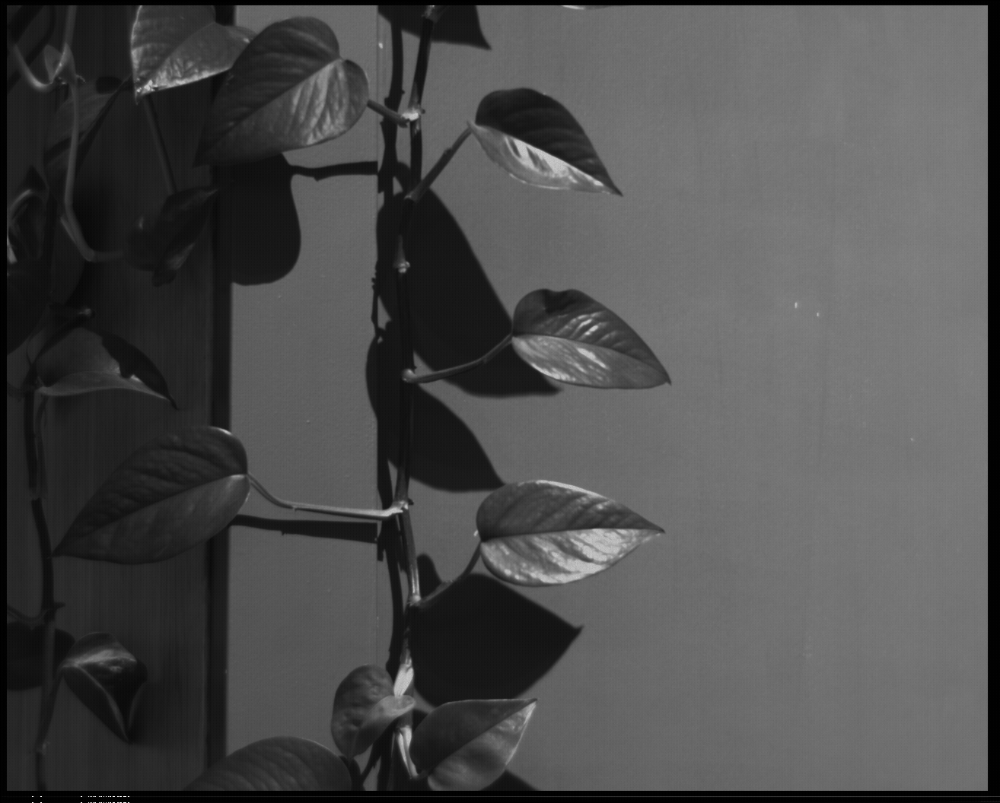

# Meerkat Monochrome

Meerkat Monochrome is a monochrome camera project that I started as a hobby. From the PCB design to the firmware, you will find all project files in this repository. The camera consists of:
- an MT9M001C12STM sensor (1312x1048)
- an RP2354A used as the camera's processing and control unit
- an APS6404L-3SQR QSPI PSRAM for the frame buffer
- an FM25L16B F-RAM to permanently store data (e.g., the frame count)

The sensor runs at 6 MHZ due to the speed limitations of the frame buffer. This also means the project doesn't require a high-speed PCB, which makes my job easier since I'm not a professional PCB designer.

The PCB design uses 0402 passive components but can easily be assembled using reflow soldering.

The firmware is implemented in Rust but is still under development and not yet complete. When this project started, there was no Rust library available to interface with the MT9M001C12STM sensor, so this repository also incleads a tool that automatically generates a library from a JSON sensor description file. Please see the `mt9m001` project for details.

# Examples

An example image taken during prototype PCB testing:

If you have a close look at the image above, you can see the fixed pattern noise. It is more visible when the sensor is evenly exposed to light.

