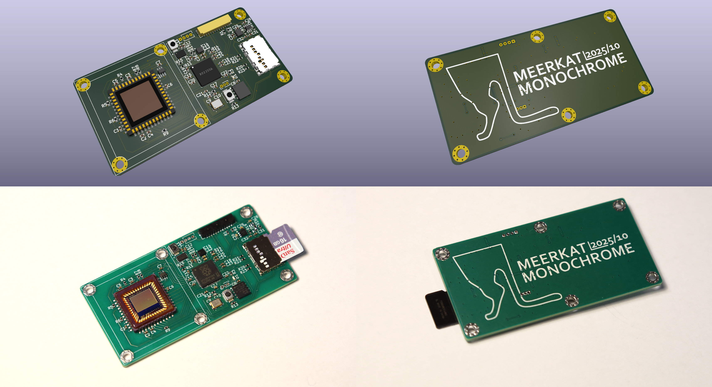
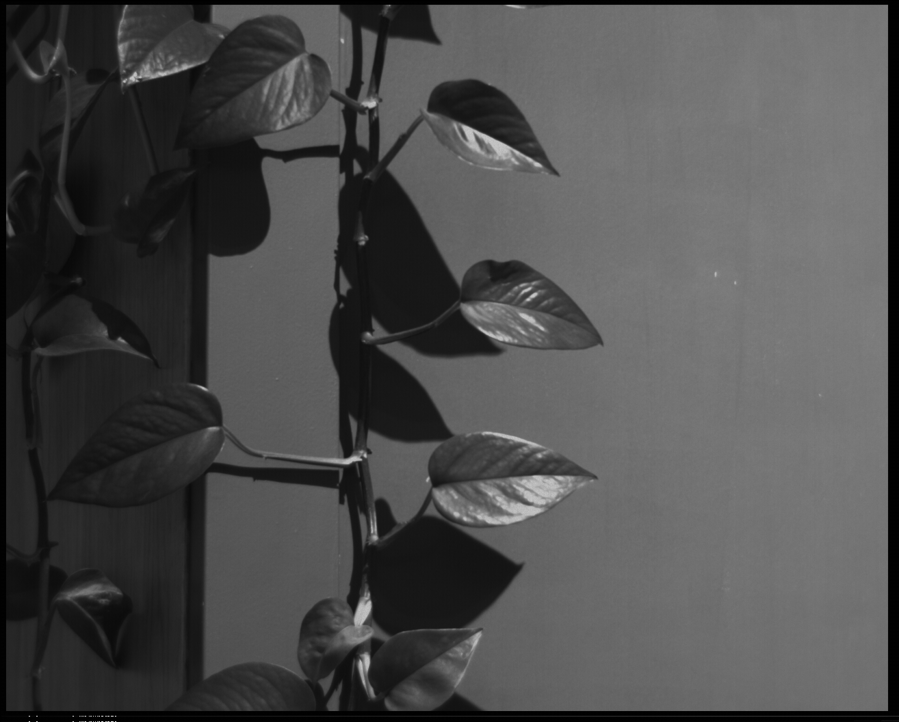

# Meerkat Monochrome

Meerkat Monochrome is a monochrome camera project that I started as a hobby. This repository contains the complete design, including PCB layouts, firmware, and supporting tools. The camera hardware consists of:
- an MT9M001C12STM monochrome image sensor (1312 × 1048)
- an RP2354A used as the camera's processing and control unit
- an APS6404L-3SQR QSPI PSRAM for the frame buffer
- an FM25L16B F-RAM to permanently store data (e.g., the frame count)

The image sensor itself is capable of operating at clock speeds up to 48 MHz. However, in this design the pixel clock is set to 6.5 MHz, because the PSRAM frame buffer cannot accept data at higher throughput. This also means the project doesn't require a high-speed PCB, which makes my job easier since I'm not a professional PCB designer.

The PCB design has tiny 0402 components. They require a steady hand, but you can still assemble the board manually using a reflow oven.

The firmware is written entirely in Rust and is actively under development. When this project started, there was no Rust library available to interface with the MT9M001C12STM sensor, so this repository also incleads a tool that automatically generates a library from a JSON sensor description file. Please see the `mt9m001` project for details.

# Examples

An example image taken during prototype PCB testing:

If you have a close look at the image above, you can see the fixed pattern noise. It is more visible when the sensor is evenly exposed to light.

